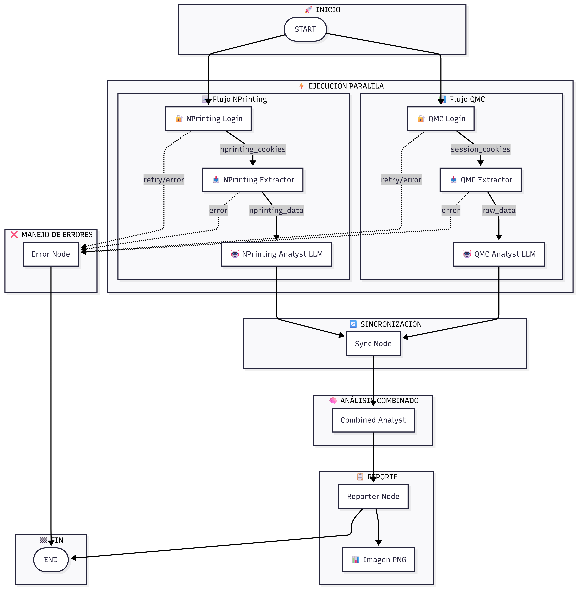
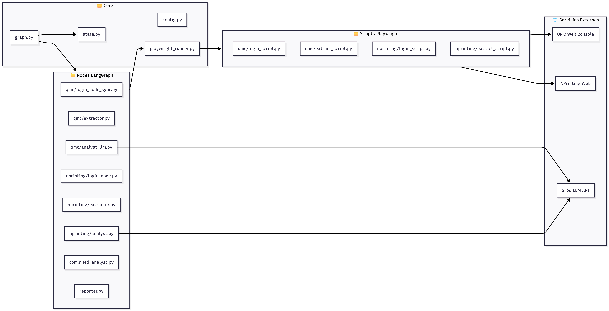
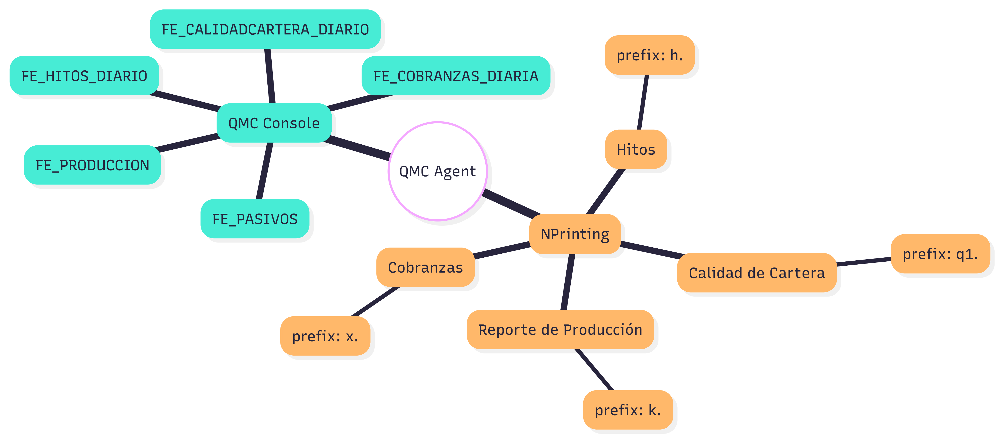
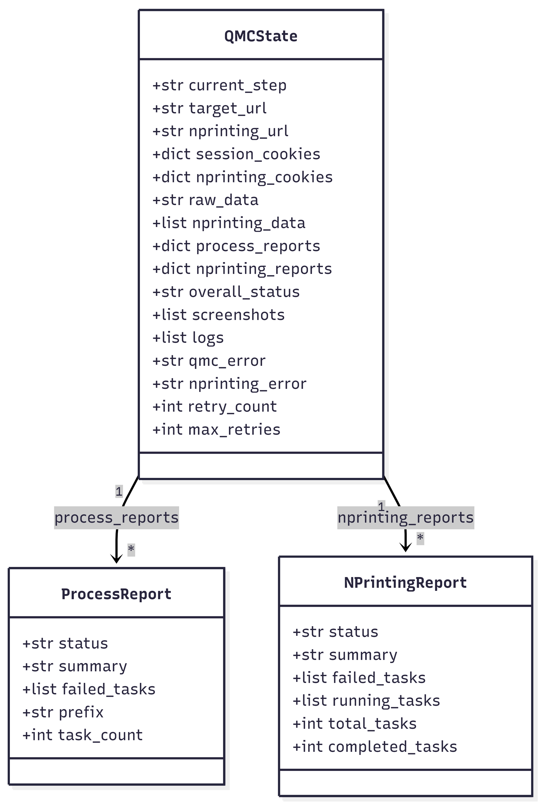

# QMC Agent - AI Powered Qlik Reporting System

<div align="center">


**Sistema autónomo de múltiples agentes para monitorear, extraer, analizar y reportar tareas de QMC y NPrinting**

</div>

---

## 🎯 Descripción

El **QMC Agent** es un sistema multi-agente que monitorea automáticamente:

- **QMC (Qlik Management Console)**: Extrae y analiza tareas de recarga
- **NPrinting**: Extrae y analiza tareas de publicación de reportes

Utiliza **LLaMA 3 (via Groq)** para interpretar los estados de las tareas y genera reportes visuales ejecutivos en formato PNG.

---

## 🧠 Arquitectura del Sistema

El sistema utiliza una **Arquitectura Multi-Agente** orquestada por [LangGraph](https://langchain-ai.github.io/langgraph/) con ejecución paralela.

### Diagrama de Flujo Principal



### Diagrama de Componentes



### Diagrama de Secuencia


---

## ⚡ Flujo de Ejecución

```
                    ┌─────────────────────────────────────┐
                    │              START                   │
                    └─────────────────┬───────────────────┘
                                      │
              ┌───────────────────────┴───────────────────────┐
              │                                               │
    ┌─────────▼─────────┐                         ┌──────────▼──────────┐
    │   🔐 QMC Login    │                         │  🔐 NPrinting Login │
    └─────────┬─────────┘                         └──────────┬──────────┘
              │                                               │
    ┌─────────▼─────────┐                         ┌──────────▼──────────┐
    │  📥 QMC Extractor │                         │ 📥 NPrinting Extract│
    │  (Playwright)     │                         │ (Today + Paginate)  │
    └─────────┬─────────┘                         └──────────┬──────────┘
              │                                               │
    ┌─────────▼─────────┐                         ┌──────────▼──────────┐
    │  🤖 QMC Analyst   │                         │ 🤖 NPrinting Analyst│
    │  (Groq LLM)       │                         │ (Groq LLM)          │
    └─────────┬─────────┘                         └──────────┬──────────┘
              │                                               │
              └───────────────────────┬───────────────────────┘
                                      │
                          ┌───────────▼───────────┐
                          │    🔄 Sync Node       │
                          └───────────┬───────────┘
                                      │
                          ┌───────────▼───────────┐
                          │ 🧠 Combined Analyst   │
                          └───────────┬───────────┘
                                      │
                          ┌───────────▼───────────┐
                          │   📊 Reporter Node    │
                          │   (Generate PNG)      │
                          └───────────┬───────────┘
                                      │
                          ┌───────────▼───────────┐
                          │          END          │
                          └───────────────────────┘
```

---

## 🤖 Los Agentes (Nodes)

| Agent | Responsabilidad | Archivo | Output |
|:------|:----------------|:--------|:-------|
| **QMC Login** | Autenticación en QMC Console | `nodes/qmc/login_node_sync.py` | Session Cookies |
| **QMC Extractor** | Navega y extrae tareas de QMC | `nodes/qmc/extractor.py` | Raw Task Data |
| **QMC Analyst** | Analiza estados con LLaMA 3 | `nodes/qmc/analyst_llm.py` | Process Reports |
| **NPrinting Login** | Autenticación en NPrinting | `nodes/nprinting/login_node.py` | NPrinting Cookies |
| **NPrinting Extractor** | Filtra "Today" y pagina | `nodes/nprinting/extractor.py` | NPrinting Data |
| **NPrinting Analyst** | Analiza por prefijo (h., q1., k., x.) | `nodes/nprinting/analyst.py` | NPrinting Reports |
| **Combined Analyst** | Combina reportes QMC + NPrinting | `nodes/combined_analyst.py` | Overall Status |
| **Reporter** | Genera reporte visual PNG | `nodes/reporter.py` | PNG Image |

---

## 📊 Procesos Monitoreados



### QMC Console
| Proceso | Descripción |
|:--------|:------------|
| `FE_HITOS_DIARIO` | Hitos diarios |
| `FE_COBRANZAS_DIARIA` | Cobranzas diarias |
| `FE_PASIVOS` | Pasivos |
| `FE_PRODUCCION` | Producción |
| `FE_CALIDADCARTERA_DIARIO` | Calidad de cartera |

### NPrinting
| Alias | Prefijo | Descripción |
|:------|:--------|:------------|
| Hitos | `h.` | Reportes de hitos |
| Calidad de Cartera | `q1.` | Reportes de calidad de cartera |
| Reporte de Producción | `k.` | Reportes de producción |
| Cobranzas | `x.` | Reportes de cobranzas |

---

## 📂 Estructura del Proyecto



```
qmc-agent/
├── src/
│   ├── main_agent.py          # 🚀 Entry Point (Multi-Agent Mode)
│   ├── graph.py               # 🗺️ Definición del grafo LangGraph
│   ├── state.py               # 📦 Schema del estado compartido
│   ├── config.py              # ⚙️ Configuración y secretos
│   ├── playwright_runner.py   # 🌉 Bridge para subprocesos Playwright
│   │
│   ├── nodes/                 # 🧠 Cerebro de cada agente
│   │   ├── qmc/
│   │   │   ├── login_node_sync.py
│   │   │   ├── extractor.py
│   │   │   └── analyst_llm.py
│   │   ├── nprinting/
│   │   │   ├── login_node.py
│   │   │   ├── extractor.py
│   │   │   └── analyst.py
│   │   ├── combined_analyst.py
│   │   └── reporter.py
│   │
│   └── scripts/               # 🤖 Lógica de ejecución Playwright
│       ├── qmc/
│       │   ├── login_script.py
│       │   └── extract_script.py
│       └── nprinting/
│           ├── login_script.py
│           └── extract_script.py
│
├── docs/                      # 📖 Documentación
│   └── architecture.md        # Diagramas Mermaid
├── images/                    # 🖼️ Imágenes de arquitectura
├── logs/                      # 📝 Logs de ejecución
├── reportes/                  # 📊 Reportes PNG generados
├── .env                       # 🔑 Variables de entorno
└── requirements.txt           # 📦 Dependencias
```

---

## 📊 Lógica de Estados (Analyst)

El Analyst Agent aplica una jerarquía estricta para determinar el estado:

| Prioridad | Estado | Condición |
|:---------:|:------:|:----------|
| 1 | 🔴 **FAILED** | Si *alguna* tarea falló |
| 2 | 🟠 **RUNNING** | Si no hay fallos pero hay tareas ejecutándose |
| 3 | ⚪ **PENDING** | Si no hay fallos/running pero hay tareas en cola |
| 4 | 🟢 **SUCCESS** | Si *todas* las tareas completaron exitosamente |
| 5 | ⚫ **NO RUN** | Si no hay ejecuciones registradas para hoy |

---

## 🛠️ Instalación

### 1. Clonar el repositorio
```bash
git clone <repository-url>
cd qmc-agent
```

### 2. Crear entorno virtual
```bash
python -m venv venv
.\venv\Scripts\activate  # Windows
source venv/bin/activate  # Linux/Mac
```

### 3. Instalar dependencias
```bash
pip install -r requirements.txt
playwright install chromium
```

### 4. Configurar variables de entorno
Crear archivo `.env`:
```env
# QMC Configuration
QMC_URL=https://your-qmc-server/qmc
QMC_USERNAME=your_username
QMC_PASSWORD=your_password

# NPrinting Configuration
NPRINTING_URL=https://your-nprinting-server:4993
NPRINTING_EMAIL=your_email
NPRINTING_PASSWORD=your_password

# LLM Configuration
GROQ_API_KEY=your_groq_api_key

# Browser Configuration
HEADLESS=True
TIMEOUT_MS=60000
```

---

## 🚀 Ejecución

### Modo Multi-Agente (Recomendado)
```bash
python src/main_agent.py
```

**Output esperado:**
```
🚀 Starting Unified Multi-Agent Workflow (QMC + NPrinting)
📅 Execution Time: 2026-02-05 10:00:00
▶️ Invoking Unified Graph (QMC + NPrinting in parallel)...
   [NPrinting Login] Authentication successful!
   [QMC Login] Authentication successful!
   [QMC Extractor] Extracted 125 tasks
   [NPrinting Extractor] Extracted 193 tasks (Filter: True)
   [QMC Analyst] Analyzing 5 processes...
   [NPrinting Analyst] Analyzing 4 process groups...
   [Combined Analyst] Overall Status: Success
   [Reporter] Report saved to: reportes/05_02_2026/unified_report.png
🏁 Workflow Completed Successfully
```

---

## 📋 Dependencias Principales

| Paquete | Versión | Uso |
|:--------|:--------|:----|
| `langgraph` | ^0.3 | Orquestación de agentes |
| `langchain-groq` | ^0.3 | Integración con LLaMA 3 |
| `playwright` | ^1.49 | Automatización de browser |
| `pillow` | ^11.0 | Generación de reportes PNG |
| `python-dotenv` | ^1.0 | Manejo de variables de entorno |


---

<div align="center">

**Desarrollado por Kevin Lopez para Efectiva**

</div>
