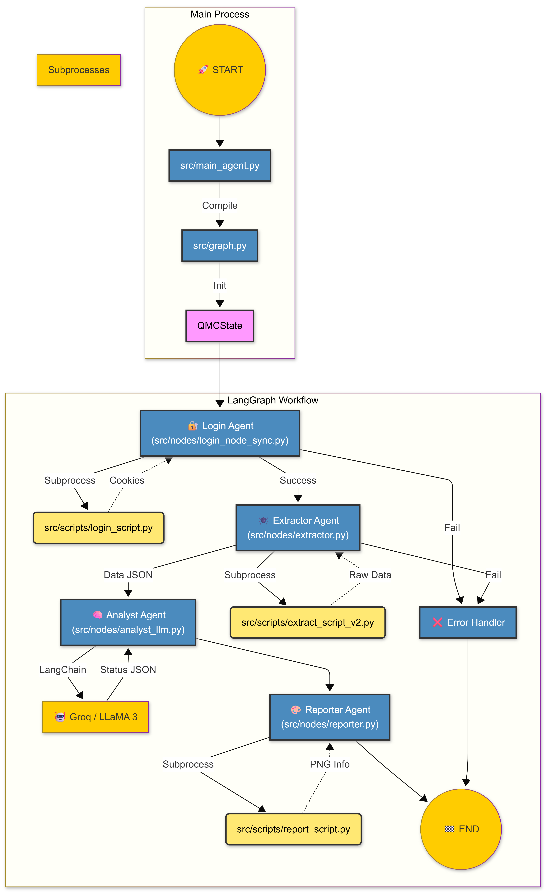

# QMC Agent - AI Powered Qlik Reporting System

The **QMC Agent** is an autonomous multi-agent system designed to monitor, extract, analyze, and report on Qlik Management Console (QMC) tasks. It utilizes Large Language Models (LLaMA 3 via Groq) to intelligently interpret task statuses and generate visual executive reports.

## 🧠 System Architecture

The system operates using a **Multi-Agent Architecture** orchestrated by [LangGraph](https://langchain-ai.github.io/langgraph/). It treats the process as a state machine where data flows between specialized agents.

### The Agentic Workflow (V2.1)

#### 1. Visual Flow (Mermaid)


#### 2. Textual Flow (ASCII)
For environments where the graph above doesn't render:
```text
[START] 
   ⬇
[🔐 Login Agent] --(Fail)--> [❌ Error Handler] ➡ [END]
   ⬇ (Success)
[🕷️ Extractor Agent] --(Fail)--> [❌ Error Handler]
   ⬇ (Data)
[🧠 Analyst Agent]
   ⬇ (Semantic Report)
[🎨 Reporter Agent]
   ⬇
 [END]
```

---

## 🤖 The Agents (Nodes)

Each component in the system is designed as an independent agent with a specific responsibility.

| Agent | Responsibility | Implementation | Output |
| :--- | :--- | :--- | :--- |
| **Login Agent** | Security & Access Protocol. Handles authentication cookies and session management. | `src/nodes/login_node_sync.py` | Valid Session Cookies |
| **Extractor Agent** | Navigation & Scouting. Filters the QMC "Task View", applies date filters (Today), and scrapes raw table data. | `src/nodes/extractor.py` | Raw Task Data (JSON) |
| **Analyst Agent** | Intelligence Layer. Uses **LLaMA 3** to interpret raw statuses into a simplified 4-State Logic (`Success`, `Running`, `Failed`, `Pending`). | `src/nodes/analyst_llm.py` | Semantic Status Report |
| **Reporter Agent** | Visual Communication. Generates a pixel-perfect PNG report using PIL based on the Analyst's findings. | `src/nodes/reporter.py` | PNG Image Path |

---

## 📂 Project Structure

The project has been refactored for clarity and scalability.

```
qmc_agent/
├── src/
│   ├── main.py             # 🚀 Entry Point (Linear Mode - Stable/Native)
│   ├── main_agent.py       # 🤖 Entry Point (Agent Mode - Experimental/LangGraph)
│   ├── graph.py            # 🗺️ Architecture Definition (The "Map")
│   ├── state.py            # 📦 Shared State Schema (The "Memory")
│   ├── config.py           # ⚙️ Configuration & Secrets
│   ├── playwright_runner.py# 🌉 Subprocess Bridge (Fixes Asyncio conflicts)
│   │
│   ├── nodes/              # The "Brain" of each Agent
│   │   ├── login_node_sync.py
│   │   ├── extractor.py
│   │   ├── analyst_llm.py
│   │   └── reporter.py
│   │
│   ├── scripts/            # The "Hands" (Execution Logic)
│   │   ├── login_script.py
│   │   ├── extract_script_v2.py
│   │   └── report_script.py
│   │
│   └── legacy/             # 🏛️ Archived files (Do not use)
│
├── logs/                   # 📝 Execution Logs
├── reportes/               # 📊 Generated PNG Reports
├── .env                    # 🔑 Secrets (Credentials, API Keys)
└── requirements.txt        # 📦 Dependencies
```

---

## 🚦 Execution Modes

The system supports two execution paradigms depending on your needs.

### 1. Agentic Mode (Recommended for Future)
Uses the LangGraph architecture. Ideal for adding complexity, human-in-the-loop, or conditional logic later.
```bash
python src/main_agent.py
```

### 2. Linear Mode (Production Stable)
A sequential execution script. Simpler, faster for debugging basic flows, and robust for simple cron jobs.
```bash
python src/main.py
```

---

## 📊 Status Logic (Analyst)

The Analyst Agent enforces a strict hierarchy to determine the status of a Process Group (e.g., "FE_HITOS").

1.  🔴 **FAILED** (Highest Priority): If *ANY* task failed.
2.  🟠 **RUNNING**: If *NO* failures, but *ANY* task is currently running.
3.  ⚪ **PENDING**: If *NO* failures/running, but tasks are queued/waiting.
4.  🔵 **SUCCESS**: If and only if *ALL* tasks completed successfully.

---

## 🛠️ Setup

1.  **Environment Variables**: Ensure `.env` is configured.
    ```env
    QMC_URL=...
    QMC_USERNAME=...
    QMC_PASSWORD=...
    GROQ_API_KEY=...
    HEADLESS=True
    ```
2.  **Install Dependencies**:
    ```bash
    pip install -r requirements.txt
    ```
