# QMC Agent - Arquitectura del Sistema

## Diagrama de Flujo Principal

```mermaid
flowchart TB
    subgraph INICIO["🚀 INICIO"]
        START([START])
    end

    subgraph PARALLEL["⚡ EJECUCIÓN PARALELA"]
        direction TB
        
        subgraph QMC_FLOW["📊 Flujo QMC"]
            QMC_LOGIN["🔐 QMC Login"]
            QMC_EXTRACT["📥 QMC Extractor"]
            QMC_ANALYST["🤖 QMC Analyst LLM"]
            
            QMC_LOGIN -->|session_cookies| QMC_EXTRACT
            QMC_EXTRACT -->|raw_data| QMC_ANALYST
        end
        
        subgraph NP_FLOW["📈 Flujo NPrinting"]
            NP_LOGIN["🔐 NPrinting Login"]
            NP_EXTRACT["📥 NPrinting Extractor"]
            NP_ANALYST["🤖 NPrinting Analyst LLM"]
            
            NP_LOGIN -->|nprinting_cookies| NP_EXTRACT
            NP_EXTRACT -->|nprinting_data| NP_ANALYST
        end
    end

    subgraph SYNC["🔄 SINCRONIZACIÓN"]
        SYNC_NODE["Sync Node"]
    end

    subgraph ANALYSIS["🧠 ANÁLISIS COMBINADO"]
        COMBINED["Combined Analyst"]
    end

    subgraph OUTPUT["📋 REPORTE"]
        REPORTER["Reporter Node"]
        REPORT_IMG["📊 Imagen PNG"]
    end

    subgraph FIN["🏁 FIN"]
        END_NODE([END])
    end

    subgraph ERROR_FLOW["❌ MANEJO DE ERRORES"]
        ERROR["Error Node"]
    end

    START --> QMC_LOGIN
    START --> NP_LOGIN
    
    QMC_ANALYST --> SYNC_NODE
    NP_ANALYST --> SYNC_NODE
    
    SYNC_NODE --> COMBINED
    COMBINED --> REPORTER
    REPORTER --> REPORT_IMG
    REPORTER --> END_NODE
    
    QMC_LOGIN -.->|retry/error| ERROR
    NP_LOGIN -.->|retry/error| ERROR
    QMC_EXTRACT -.->|error| ERROR
    NP_EXTRACT -.->|error| ERROR
    ERROR --> END_NODE
```

## Diagrama de Componentes

## Diagrama de Secuencia

## Diagrama de Estado

## Estructura de Datos (State)

## Procesos Monitoreados

```mermaid
mindmap
    root((QMC Agent))
        QMC Console
            FE_HITOS_DIARIO
            FE_COBRANZAS_DIARIA
            FE_PASIVOS
            FE_PRODUCCION
            FE_CALIDADCARTERA_DIARIO
        NPrinting
            Hitos
                prefix: h.
            Calidad de Cartera
                prefix: q1.
            Reporte de Producción
                prefix: k.
            Cobranzas
                prefix: x.
```

